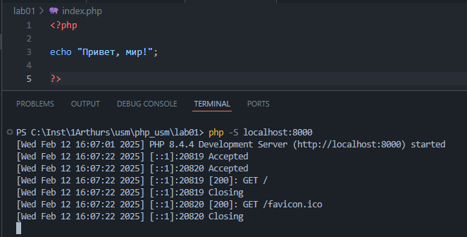
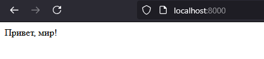
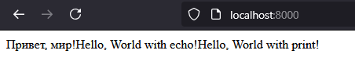

# Лабораторная работа: Установка и первые шаги с PHP

## 1. Установка PHP
Загружена последняя версия **PHP** (php-8.4.4-Win32-vs17-x64) с официального сайта в виде архива.
Архив распакован в удобную директорию, а путь к ней добавлен в переменную среды `PATH`.

## 2. Написание первой программы на PHP




Создаём простой PHP-файл и добавляем в него код:
```php
<?php

echo "Привет, мир!";
echo "Hello, World with echo!";
print "Hello, World with print!";

?>
```



## 3. Работа с переменными и выводом

Пример объявления переменных и различных способов вывода данных:
```php
<?php

$days = 288;
$message = "Все возвращаются на работу!";

// Вывод конкатенацией
echo $days . " дней. " . $message . "<br>";

// Вывод с помощью двойных кавычек
echo "$days дней. $message<br>";

?>
```

## 4. Ответы на вопросы

1. **Какие способы установки PHP существуют?**  
   - Ручная установка, скачав архив с официального сайта.  
   - С помощью установщика (например, XAMPP).  
   - Через пакетный менеджер (choco, apt, yum и т.д.).

2. **Как проверить, что PHP установлен и работает?**  
   - Выполнить в командной строке команду `php -v`.  
   - Создать PHP-файл с вызовом `phpinfo();` и открыть его через веб-сервер.

3. **Чем отличается оператор `echo` от `print`?**  
   - `echo` не возвращает значение и может принимать несколько аргументов, работает быстрее.  
   - `print` возвращает целочисленное значение (1) и принимает только один аргумент, работает медленнее.

