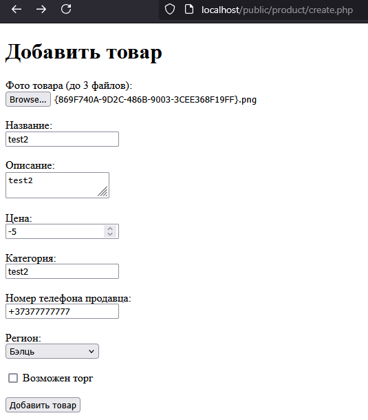
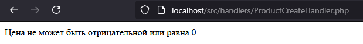
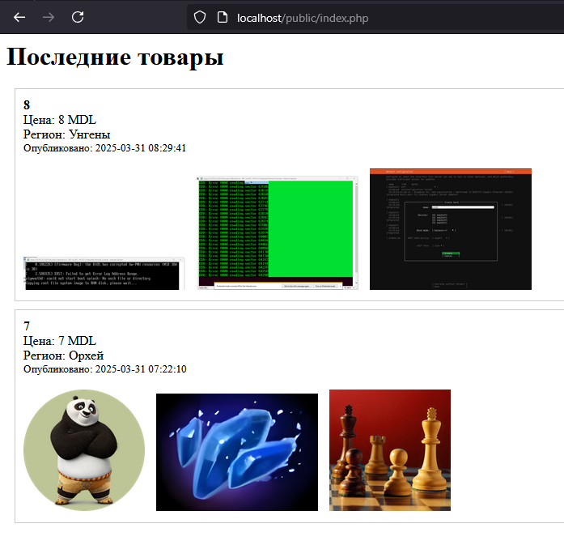
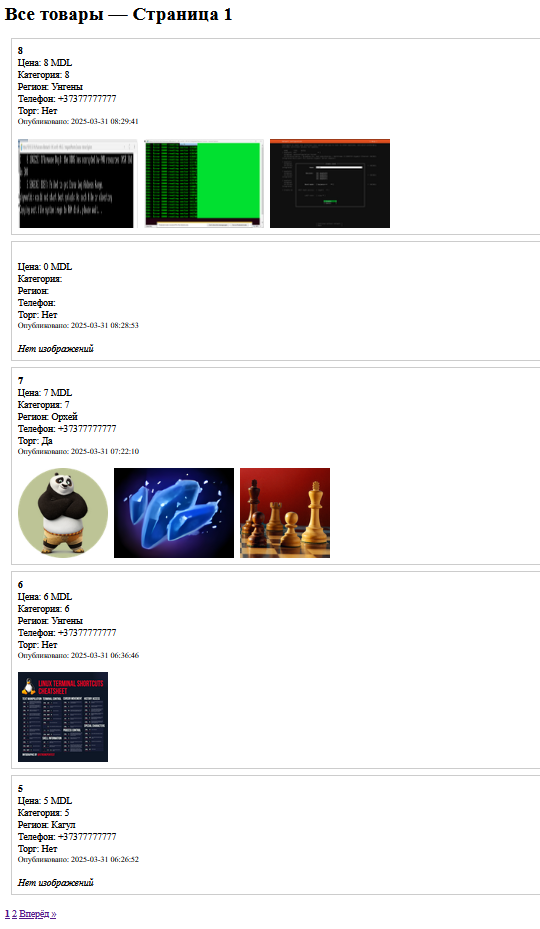
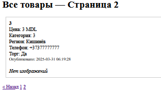

# Отчет по лабораторной работе: Работа с HTML-формами в PHP

## Цель работы

Освоить основные принципы работы с HTML-формами в PHP, включая отправку данных на сервер, их обработку, валидацию и сохранение. Работа является базовой для дальнейших лабораторных работ.

---

## Этап 1. Создание проекта

Была создана структура проекта `online_shop`:

```bash
online_shop
├── readme.md
├── public
│   ├── index.php
│   ├── cart
│   │   ├── checkout.php
│   │   └── index.php
│   └── product
│       ├── create.php
│       ├── delete.php
│       ├── index.php
│       ├── test
│       └── update.php
├── src
│   ├── helpers.php
│   └── handlers
│       ├── CartHandler.php
│       ├── ProductCreateHandler.php
│       ├── ProductDeleteHandler.php
│       └── ProductUpdateHandler.php
└── storage
    ├── orders.json
    ├── products.json
    └── uploads
```

---

## Этап 2. Создание HTML-формы

В файле `public/product/create.php` была реализована HTML-форма для добавления товара:

- Название
- Описание
- Цена
- Регион (выпадающий список)
- Фотографии (do 3x)
- Торг (чекбокс)
- Телефон

> 

---

## Этап 3. Обработка данных

В файле `src/handlers/ProductCreateHandler.php` были реализованы:

- Фильтрация входных данных с помощью `htmlspecialchars` и `trim`
- Валидация (формат телефона, размер и тип файлов)
- Обработка и сохранение загруженных изображений
- Сохранение товара в `storage/products.json`
- Перенаправление на главную страницу

> 

---

## Этап 4. Отображение товаров

### В `public/index.php`

Вывод двух последних товаров по дате `created_at`. Если есть изображения, они тоже отображаются.

> 

### В `public/product/index.php`

Все товары отображаются в цикле, включая:
- имя, цену, категорию, телефон, регион
- каждое загруженное изображение

> 

---

## Дополнительно: Пагинация

В `product/index.php` реализован вывод по 5 товаров на страницу с использованием GET-параметра `page`. Если page не указан, выводится первая страница.

> 

---

## Контрольные вопросы

**1. Какие HTTP-методы используются для отправки форм?**
- Метод: `POST`. `POST` — для отправки данных формы на сервер.

**2. Что такое валидация данных и чем она отличается от фильтрации?**
- **Фильтрация** — это очистка входных данных от ненужных символов и потенциально опасного содержимого.
- **Валидация** — это проверка, соответствуют ли данные определённым требованиям (например, формат телефона, диапазон цены и т.д.).

**3. Какие функции PHP используются для фильтрации данных?**
- `trim()` — удаляет пробелы в начале и в конце строки
- `htmlspecialchars()` — преобразует специальные символы в HTML-сущности
- `filter_var()` — фильтрация и валидация (например, чисел и email)
- `strip_tags()` — удаляет HTML-теги из строки

---

## Вывод

В ходе лабораторной работы были освоены:
- Создание HTML-форм и их структура
- Отправка данных методом POST
- Обработка данных на сервере
- Фильтрация и валидация пользовательского ввода
- Работа с файлами (JSON и загрузка изображений)
- Организация файловой структуры проекта
- Реализация простейшей пагинации

Полученные знания и код станут основой для последующих лабораторных работ, связанных с разработкой полноценных веб-приложений на PHP.


