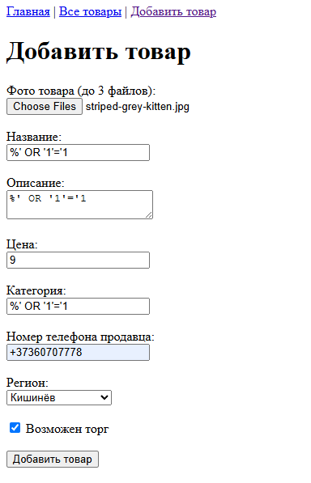
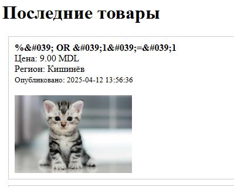

# Лабораторная работа №5 – Онлайн-магазин

## Цель работы

Цель данной лабораторной работы – освоить следующие технологии и подходы:
- Реализация архитектуры веб-приложения с единой точкой входа.
- Использование шаблонов для визуализации страниц.
- Переход от хранения данных в файле к использованию базы данных (MySQL).
- Реализация CRUD (создание, чтение, обновление, удаление) функциональности с валидацией данных.
- Защита от SQL-инъекций с использованием подготовленных выражений.
- Реализация пагинации с использованием SQL-запросов (LIMIT и OFFSET).

---

## Задание 1. Подготовка среды

Поднимаю LAMP:

```bash
mysql --version
mysql  Ver 8.0.41-0ubuntu0.24.04.1 for Linux on x86_64 ((Ubuntu))
```

```bash
php -v
PHP 8.3.6 (cli)
```

```bash
apachectl -V
Server version: Apache/2.4.58 (Ubuntu)
```

```bash
sudo a2enmod rewrite
```

Конфигурация Apache2:
```conf
<VirtualHost *:80>
        DocumentRoot /var/www/html/public
        <Directory /var/www/html/public>
                Options Indexes FollowSymLinks
                AllowOverride All
                Require all granted
        </Directory>
        ErrorLog ${APACHE_LOG_DIR}/error.log
        CustomLog ${APACHE_LOG_DIR}/access.log combined
</VirtualHost>
```

Создаю базу данных под названием online_shop:

```sql
CREATE DATABASE online_shop;
```

Создайте таблицу product со следующей структурой

```sql
CREATE TABLE products (
    id VARCHAR(32) PRIMARY KEY,
    name VARCHAR(255) NOT NULL,
    description TEXT,
    price DECIMAL(10, 2) NOT NULL,
    category VARCHAR(100),
    phone VARCHAR(20),
    region VARCHAR(100),
    is_bargain BOOLEAN DEFAULT FALSE,
    created_at DATETIME NOT NULL DEFAULT CURRENT_TIMESTAMP
);
```

```sql
CREATE TABLE product_images (
    id INT AUTO_INCREMENT PRIMARY KEY,
    product_id VARCHAR(32),
    image_path VARCHAR(255),
    FOREIGN KEY (product_id) REFERENCES products(id) ON DELETE CASCADE
);
```


## Задание 2. Архитектура и шаблонизация
Единая точка входа:
В корневой папке public/ создаю файл index.php, который будет служить основной точкой входа. Все запросы будут обрабатываться через этот файл.

Маршрутизация:
Настраиваю маршрутизацию в файле src/routes.php, которая распределяет запросы на нужные шаблоны или обработчики по URL (например, /, /product, /product/create, /product/update, /product/delete).

```php
<?php
$uri = parse_url($_SERVER['REQUEST_URI'], PHP_URL_PATH);
$uri = rtrim($uri, '/');
if ($uri === '') {
    $uri = '/';
}

switch ($uri) {
    case '/':
    case '/index':
        require __DIR__ . '/../templates/index.php';
        break;
    case '/product':
        require __DIR__ . '/../templates/product/index.php';
        break;
    case '/product/create':
        if ($_SERVER['REQUEST_METHOD'] === 'POST') {
            require __DIR__ . '/../src/handlers/products/create.php';
        } else {
            require __DIR__ . '/../templates/product/create.php';
        }
        break;
    case '/product/update':
        if ($_SERVER['REQUEST_METHOD'] === 'POST') {
            require __DIR__ . '/../src/handlers/products/update.php';
        } else {
            require __DIR__ . '/../templates/product/update.php';
        }
        break;
    case '/product/delete':
        require __DIR__ . '/../src/handlers/products/delete.php';
        break;
    default:
        http_response_code(404);
        echo "<h1>404 — страница не найдена</h1>";
}
```


Шаблоны:
Создайте базовый шаблон templates/layout.php, который содержит общую структуру HTML (хедер, навигация, футер).
Затем создайте отдельные шаблоны для:

Главной страницы (templates/index.php) – отображение последних товаров.

Страницы с отображением всех товаров (templates/product/index.php).

Страницы добавления товара (templates/product/create.php).

Страницы редактирования товара (templates/product/update.php).

## Задание 3. Подключение к базе данных

### Файл подключения:
В файле src/db.php реализую подключение к базе данных с использованием PDO.
PDO — это интерфейс для работы с базами данных в PHP.
PDO поддерживает подготовленные выражения (prepared statements), что помогает защищаться от SQL-инъекций.

Реализую класс базы данных, в котором при помощи методов обрабатываю все обращения к бд.

```php
class Database {
    ...
    public function query(...){...}
    public function insertProduct(...){...}
    public function insertProductImages(...){...}
    public function deleteProduct(...){...}
}
```

1. Защита от SQL-инъекций
Все SQL-запросы выполняются через подготовленные выражения, что защищает от SQL инъекции при помощи `user input`.
Вредоносный код будет обработан как обычная строка.
Экранирование символов — замена в тексте управляющих (служебных) символов на соответствующие им последовательности символов.

```php
$sql = "INSERT INTO products (id, name, description, price, category, phone, region, is_bargain, created_at)
                VALUES (:id, :name, :description, :price, :category, :phone, :region, :is_bargain, :created_at)";
        $params = [
            ':id'          => $productData['id'],
            ':name'        => $productData['name'],
            ':description' => $productData['description'],
            ':price'       => $productData['price'],
            ':category'    => $productData['category'],
            ':phone'       => $productData['phone'],
            ':region'      => $productData['region'],
            ':is_bargain'  => $productData['is_bargain'] ? 1 : 0,
            ':created_at'  => $productData['created_at']
        ];

        $this->query($sql, $params);
```

2. Валидация входных данных:
Все входные данные фильтруются и экранируются (например, через filter_var() и htmlspecialchars()), что предотвращает некорректное исполнение SQL-запросов.
Пример валидации в коде:
```php
function validateProductData($productData) {
    global $regions;
    $validationErrorMessages = [];

    if (!preg_match('/^\+373\d{8}$/', $productData['phone'])) {
        $validationErrorMessages[] = "Номер телефона должен быть в формате +373xxxxxxxx";
    }

    if ($productData['price'] <= 0) {
        $validationErrorMessages[] = "Цена не может быть отрицательной или равна 0";
    }

    if (!in_array($productData['region'], $regions)) {
        $validationErrorMessages[] = "Некорректный регион!";
    }
    ...
}
```

3. Демонстрация уязвимости:
Если бы данные вставлялись напрямую в SQL-запрос, пользователь мог бы ввести, например:
```sql
%' OR '1'='1
```
и получить запрос:

```sql
SELECT * FROM products WHERE name LIKE '%%' OR '1'='1%'
```
Такой запрос вернёт все записи. Использование подготовленных выражений предотвращает это, поскольку переданное значение не влияет на структуру запроса.






### Конфигурация подключения:
В файле config/db.php храню параметры подключения
```php
<?php
return [
    'host'     => 'localhost',
    'dbname'   => 'online_shop',   
    'user'     => 'root',      
    'password' => 'Password123',      
    'charset'  => 'utf8mb4',      
];
```

### Задание 5. Дополнительное задание. Пагинация
Реализация пагинации с SQL-запросом:
Для отображения 5 товаров на странице используется оператор LIMIT и OFFSET:
```php
$perPage = 5;
$totalPages = ($totalProducts > 0) ? ceil($totalProducts / $perPage) : 1;

$page = isset($_GET['page']) && is_numeric($_GET['page']) ? intval($_GET['page']) : 1;
$page = max(1, min($page, $totalPages));
$offset = ($page - 1) * $perPage;

$stmt = $db->getPdo()->prepare("SELECT * FROM products ORDER BY created_at DESC LIMIT :limit OFFSET :offset");
$stmt->bindValue(':limit', $perPage, PDO::PARAM_INT);
$stmt->bindValue(':offset', $offset, PDO::PARAM_INT);
$stmt->execute();
$paginatedProducts = $stmt->fetchAll(PDO::FETCH_ASSOC);
```

Описание механизма:

 - LIMIT задаёт количество записей, выводимых на странице (в нашем случае 5).
 - OFFSET определяет, с какой записи начинать выборку (рассчитывается как (page - 1) * perPage).
 - Общее количество страниц рассчитывается исходя из общего количества записей.

 ## Контрольные вопросы

1. **Какие преимущества даёт использование единой точки входа в веб-приложении?**
    
    - **Централизованное управление:** Все запросы проходят через один файл (index.php), что упрощает маршрутизацию и управление приложением.
    - **Безопасность:** Внутренняя логика и конфиденциальные файлы находятся вне публичной директории.
    - **Удобство отладки и масштабирования:** Легко добавлять новые маршруты и изменять логику обработки запросов.
        
2. **Какие преимущества даёт использование шаблонов?**
    
    - **Повторное использование кода:** Общие части (шапка, меню, футер) определяются один раз в базовом шаблоне (layout.php).
    - **Поддержка и масштабируемость:** Легче изменять дизайн приложения, так как изменения в шаблоне отражаются на всех страницах.
    - **Разделение логики и представления:** Логика обработки данных отделена от визуального оформления.
        
3. **Какие преимущества даёт хранение данных в базе по сравнению с хранением в файлах?**
    
    - **Производительность:** Базы данных оптимизированы для быстрого поиска, фильтрации и выборки данных.
    - **Надёжность и целостность данных:** БД поддерживают транзакции, ограничения и индексацию.
    - **Масштабируемость:** Легко работать с большими объёмами данных и выполнять сложные запросы.
    - **Безопасность:** Доступ к данным можно контролировать с помощью прав доступа, а данные централизованно управляются.
        
4. **Что такое SQL-инъекция? Придумайте пример SQL-инъекции и объясните, как её предотвратить.**
    
    - **SQL-инъекция** – это атака, при которой злоумышленник внедряет в SQL-запрос вредоносный код с целью изменения его логики.
    - **Пример:**  
        Допустим, запрос формируется путем конкатенации строки, например:
        `$search = $_GET['search']; $sql = "SELECT * FROM products WHERE name LIKE '%$search%'";`
        Если злоумышленник передаст параметр:
        `%' OR '1'='1`
        то итоговый запрос может стать:
        `SELECT * FROM products WHERE name LIKE '%%' OR '1'='1%'`
        что вернёт все записи.
    - **Предотвращение:**  
        Использование подготовленных выражений (prepared statements) с параметризованными запросами, где данные передаются отдельно от SQL-кода, делает подобные атаки невозможными. Например:
        `$search = $_GET['search']; $sql = "SELECT * FROM products WHERE name LIKE :search"; $stmt = $pdo->prepare($sql); $stmt->execute([':search' => '%' . $search . '%']);`
        Здесь параметр `:search` обрабатывается как значение, а не как часть запроса.